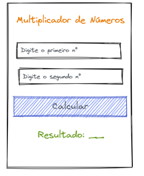

# Aplicativo 3 - Contador de Pessoas presentes na Loja (React-Native)

Este é o repositório do Aplicativo 3, um aplicativo que funciona como multiplicador de 2 números, realizado como parte do trabalho prático 1 (TP1) da disciplina de Dispositivos Móveis.

## Mockup disponibilizado

