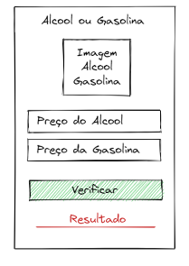

# Aplicativo 4 - Alcool ou Gasolina (React-Native)

Este é o repositório do Aplicativo 4, um aplicativo que funciona que decida entre alcool ou gasolina, levando em conta seu desempenho, realizado como parte do trabalho prático 1 (TP1) da disciplina de Dispositivos Móveis.

## Instruções fornecidas

O cálculo básico para se descobrir se o álcool é vantajoso ou não em relação à gasolina é simples. Basta dividir o preço do litro do etanol pelo da gasolina. Se o resultado for inferior a 0,7, o derivado da cana-de-açúcar é o melhor para abastecer. Se for maior que 0,7, então a gasolina é melhor.

## Mockup disponibilizado

