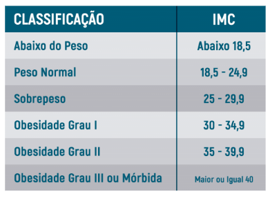
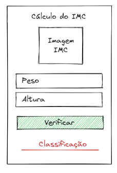

# Aplicativo 5 - Cálculo IMC (React-Native)

Este é o repositório do Aplicativo 5, um aplicativo calcule o IMC do usuário, realizado como parte do trabalho prático 1 (TP1) da disciplina de Dispositivos Móveis.

## Instruções fornecidas

Fórmula:
$$
IMC = \dfrac{peso}{altura^2}
$$

## Mockup disponibilizado

