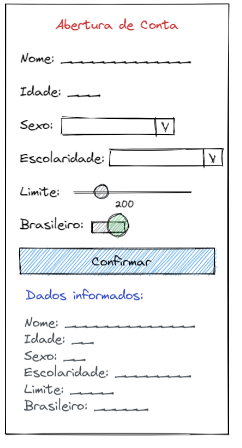

# Aplicativo 7 - Jogo do número aleatório (React-Native)

Este é o repositório do Aplicativo 7, é um formulário de abertura de conta bancária **FICTICIA** , realizado como parte do trabalho prático 1 (TP1) da disciplina de Dispositivos Móveis.

## Instruções fornecidas

- Nome (TextInput), 
- Idade (TextInput), 
- Sexo (Picker), 
- Escolaridade (Picker), 
- Limite na conta (Slider), 
- Brasileiro (Switch), 
- Botão (Button ou Pressable).

**Ao clicar no botão “Confirmar” exibir todos os dados abaixo com Texts.**

## Mockup disponibilizado

