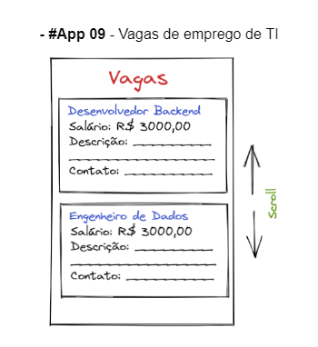

# Aplicativo 9 - Vagas de TI (React-Native)

Este é o repositório do Aplicativo 9, um aplicativo de vagas de TI desenvolvido como parte do trabalho prático 1 (TP1) da disciplina de Dispositivos Móveis.

## Mockup disponibilizado

    

## Descrição do Aplicativo 9 - Vagas de TI

O Aplicativo 9, "Vagas de TI", é uma plataforma que permite aos usuários visualizar vagas de emprego **FICTICIAS** na área de Tecnologia da Informação. Este aplicativo utiliza a componente FlatList do React-Native para exibir a lista de vagas de forma eficiente e amigável ao usuário.

## Funcionalidades

O aplicativo oferece as seguintes funcionalidades:

- **Listagem de Vagas**: Os usuários podem navegar por uma lista de vagas de TI disponíveis.

- **Detalhes da Vaga**: A vaga específica na lista, os usuários podem visualizar detalhes completos da vaga, incluindo descrição, requisitos, benefícios e informações de contato.

